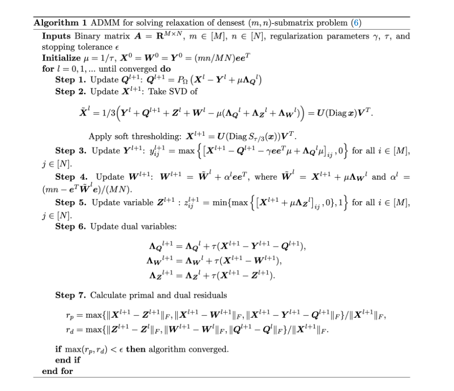
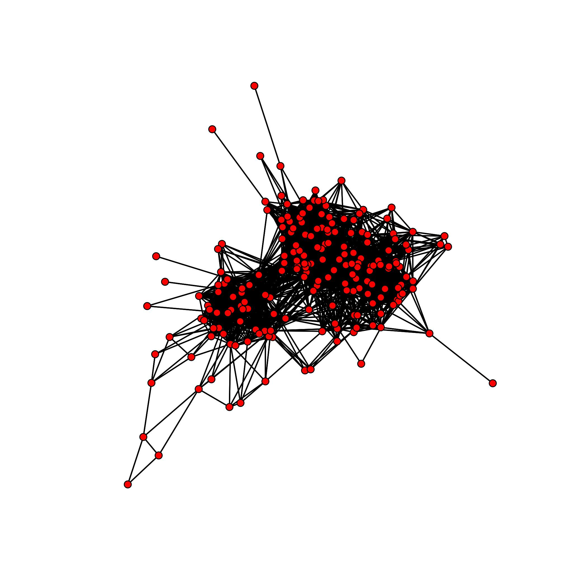

# admmDensenstSubmatrix

\usepackage{amsmath}
\usepackage{amssymb}
\usepackage{amstext}
\usepackage{mathtools}

\newcommand{\tr}{\operatorname{Tr}}
\newcommand{\rank}{\operatorname{rank}}
\newcommand{\st}{\operatorname{s.t.}}
\necommand{\P}{\operatorname{P}}


# Introduction
This is the R-package accompanying the paper ([Convex optimization for the densest subgraph and densest submatrix problems](https://github.com/bpames/Densest-Submatrix-Paper/blob/master/Manuscript/dsm-arxiv2019.pdf)).

The problem of identifying a dense submatrix is a fundamental problem in the  analysis of matrix structure and complex networks. This package provides tools for identifying the densest submatrix of a given graph using first-order optimization methods.

See the tutorials below to get started.

# The densest submatrix problem
Let $[M] = \{1,2,\dots, M\}$ for each positive integer $M$.
Given a matrix $\mathbf{A} \in R^{M\times N}$, the densest $m\times n$-submatrix problem seeks subsets $\bar U \subseteq {[M]}$ and $\bar V \subseteq {[N]}$ of cardinality
$|\bar U|=m$ and $|\bar V| = n$, respectively,
such that the submatrix $\mathbf{A}{[\bar U, \bar V]}$ with rows index by $\bar U$ and columns indexed by $\bar V$
contains the maximum number of nonzero entries. That is, the densest $m\times n$-submatrix problem seeks the densest
$m\times n$-submatrix of $\mathbf{A}$.

The densest $m\times n$-submatrix problem can be formulated as:

$$\begin{equation}
    \min_{\mathbf{X}, \mathbf{Y} \in { \{0,1\}}^{M\times N} } {\tr(\mathbf{Y} \mathbf{e} \mathbf{e}^T): \mathrm{P}_{\Omega}(\mathbf{X}-\mathbf{Y}) = \mathbf{0}, \tr(\mathbf{X} \mathbf{e} \mathbf{e}^T) = mn, \rank (\mathbf{X}) = 1 },
\end{equation}$$

where

* $\mathrm{P}_{\Omega}$ is the projection onto the index set of zero entries of matrix $\mathbf A$;

* $\tr$ is the matrix trace function;

* $\Omega$ is the index set of zero entries of matrix $A$;

* $\mathbf{X}$ is rank-one matrix with $mn$ nonzero entries;

* $\mathbf{Y}$ is used to count the number of disagreements between $\mathbf A$ and $\mathbf X$;

* $\mathbf{e}$ - all-ones vector.

Unfortunately, optimization problems involving rank and binary constraints are intractable in general.

Relaxing the rank constraint with a nuclear norm penalty term,
$\|\mathbf{X} \|_* = \sum_{i=1}^N \sigma_i(\mathbf{X})$, i.e., the sum of the singular values of matrix, and
the binary constraints with box constraints yields the convex problem:

$$\begin{align}
	\min \; & \|\mathbf{X} \|_* + \gamma \tr(\mathbf{Y} \mathbf{e} \mathbf{e}^T)  \\
	\st     \;   & \tr(\mathbf{X} \mathbf{e} \mathbf{e}^T) = mn, 	\\
			         & \mathrm{P}_\Omega(\mathbf{X} - \mathbf{Y}) = \mathbf{0},	 \\
			         & \mathbf{Y} \ge \mathbf{0}, \\
			         & \mathbf{0} \le \mathbf{X} \le \mathbf{e} \mathbf{e}^T,
\end{align}$$
where $\gamma >0$ is a regularization parameter chosen to tune between the two objectives.

It can be shown that the relaxation is exact when binary matrix $\mathbf{A}$ contains a single, relatively large dense $m\times n$ block. For more information, see ([Convex optimization for the densest subgraph and densest submatrix problems](https://github.com/bpames/Densest-Submatrix-Paper/blob/master/Manuscript/dsm-arxiv2019.pdf))

# Alternating Direction Method of multipliers for densest submatrix problem
The alternating direction method of multipliers (ADMM) has been succesfully used in a broad spectrum of applications. The ADMM solves convex optimization problems with composite objective functions subject to equality constraints.  

We direct the reader to Prof. Stephen Boyd’s website
([ADMM](http://stanford.edu/~boyd/papers/admm_distr_stats.html)) for a more thorough discussion of the ADMM.

To apply ADMM to our problem, we introduce artificial variables $\mathbf{Q}$, $\mathbf{W}$ and $\mathbf{Z}$ to obtain the equivalent optimization problem:

$$\begin{align}
	\min \; & \|\mathbf{X} \|_* + \gamma \|\mathbf{Y} \|_1 +{1}_{\Omega_Q}(\mathbf{Q})+{1}_{\Omega_W}(\mathbf{W})+{1}_{\Omega_Z}(\mathbf{Z})\\
\st       \; &  \mathbf{X}-\mathbf{Y}=\mathbf{Q},\mathbf{X}=\mathbf{W}, \mathbf{X}=\mathbf{Z}
\end{align}$$

where

* $\Omega_Q = \{\, \mathbf{Q}\in R^{M\times N} \mid P_{\tilde{N}}(Q)=0 \, \}$,
* $\Omega_W =\{\, \mathbf{W}\in R^{M\times N} \mid  \mathbf{e}^T\mathbf{W} \mathbf{e}=mn \, \}$,
* $\Omega_Z =\{\, \mathbf{Z}\in R^{M\times N} \mid  {Z}_{ij}\leq 1  \forall (i,j)\in M\times N \, \}$.

Here ${1}_{S}: R^{M\times M} \rightarrow \left \{0,+\infty \right \}$  is the indicator function of the set $S \subseteq  R^{M\times N}$,
such that
${1}_S(\mathbf{X})=0$  if $\mathbf{X}\in S$, and $+\infty$ otherwise.

Since our objective function is separable, we iteratively solve this optimization program using the ADMM.
The basic idea is to rotate through $3$ steps:

1. minimize the augmented Lagrangian over primal variables,
2. update dual variables usng the updated primal variables,
3. calculate primal and dual residuals.

Interested readers are referred to ([Convex optimization for the densest subgraph and densest submatrix problems](https://github.com/bpames/Densest-Submatrix-Paper/blob/master/Manuscript/dsm-arxiv2019.pdf)). We include a summary of the algorithm below.

{width=600px}

# Examples
We test this package on two different types of data: first, using random matrices sampled from the planted dense $m \times n$ submtarix model and, second, real-world collaboration and communication networks.

## Random matrices
We first generate a random matrix with noise obscuring the planted submatrix using the function ``plantedsubmatrix``. and then call the function ``densub`` to recover the planted submatrix.

```{r, eval=FALSE}
# Initialize problem size and densities
# You can play around with these parameters
M=100 #number of rows of sampled matrix
N=200 #number of columns of sampled matrix
m=50 #number of rows of dense submatrix
n=40 #number of columns of dense submatrix
p=0.25 # noise density
q=0.85 #in-group density

#Make binary matrix with mn-submatrix
random<-plantedsubmatrix(M=M, N=N,m=m,n=n,p=p,q=q)
```

After generating the structure `random` containing the random matrix with desired planted structure, we can visually represent the matrix and planted submatrix as two-tone images, where dark pixels correspond to nonzero entries, and light pixels correspond to zero entries, using the following commands.

```{r, eval=FALSE}

# Plot sampled G and matrix representations.
image(random$sampled_matrix, useRaster=TRUE, axes=FALSE, main = "Matrix A")
image(random$dense_submatrix, useRaster=TRUE, axes=FALSE, main = "Matrix X0")
image(random$disagreements, useRaster=TRUE, axes=FALSE, main = "Matrix Y0")
```

Tne vizualization of the randomly generated matrix $\mathbf{A}$ helps us to understand its structure. It is clear that $\mathbf{A}$ contains a dense $50 \times 40$ block (in the bottom left corner).

{width=400px}

We can remove all noise and isolate an image of a rank-one matrix $\mathbf{X0}$ with $mn$ nonzero entries.

{width=400px}


Then we vizualize matrix $\mathbf{Y0}$ to see the number of disagreements between original matrix $\mathbf{A}$ and $\mathbf{X0}$.

{width=400px}


We call the ADMM solver and visualize the output using the following commands.


```{r, eval=FALSE}
#Call ADMM solver
admm<-densub(G=random$sampled_matrix, m=m, n=n, tau = 0.35, gamma = 6/(sqrt(m*n)*(q-p)), opt_tol = 1.0e-4,maxiter=500, quiet = TRUE)


#Plot results
image(admm$X, useRaster=TRUE, axes=FALSE, main = "Matrix X")
image(admm$Y, useRaster=TRUE, axes=FALSE, main = "Matrix Y")


```


The ADMM solver returns the optimal solutions $\mathbf{X}$ and $\mathbf{Y}$. It must be noted that matrices $\mathbf X$ and $\mathbf Y$ are identical to the actual structures of $\mathbf{X_0}$ and $\mathbf{Y_0}$. The planted submatrix is recovered.

{width=400px}


{width=400px}


## Collaboration Network
The following is a simple example on how one could use the package to analyze the collaboration network found in the JAZZ dataset. It is known that this network contains a cluster of $100$ musicians which performed together.

{width=400px}

We have already prepared dataset to work with. More details can be found in the provided file `JAZZ_IN_R.R.`

```{r jazz, eval=FALSE}
#Load dataset
load(file="JAZZ.RData")

#Initialize problem size and densities
G=new #define matrix G equivalent to JAZZ dataset 
m=100 #clique size or the number of rows of the dense submatrix 
n=100 #clique size of the number of columns of the dense sumbatrix
tau=0.85 #regularization parameter
opt_tol=1.0e-2 #optimal tolerance
verbose=1
maxiter=2000 #number of iterations
gamma=8/n #regularization parameter


#call ADMM solver
admm <- densub(G = G, m = m, n = n, tau = tau, gamma = gamma, opt_tol = opt_tol, maxiter=maxiter, quiet = TRUE) 
# Planted solution X0.
X0=matrix(0L, nrow=198, ncol=198) #construct rank-one matrix X0
X0[1:100,1:100]=matrix(1L, nrow=100, ncol=100)#define dense block

# Planted solution Y0.
Y0=matrix(0L, nrow=198, ncol=198) #construct matrix for counting disagreements between G and X0
Y0[1:100,1:100]=matrix(1L,nrow=100,ncol=1000)-G[1:100,1:100]

#Check primal and dual residuals.
C=admm$X-X0
a=norm(C, "F") #Frobenius norm of matrix C 
b=norm(X0,"F") #Frobenius norm of matrix X0
recovery = matrix(0L,nrow=1, ncol=1)#create recovery matrix

if (a/b^2<opt_tol){
recovery=recovery+1
} else {
  recovery=0 #Recovery condition 
  }


```

Our algorithm converges to the dense submatrix representing the community of $100$ musicians after $50$ iterations.   
